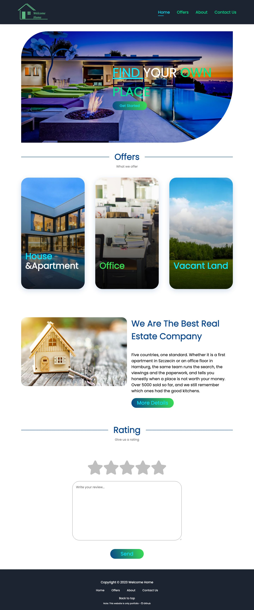
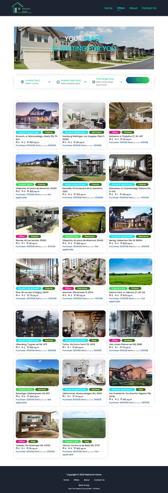
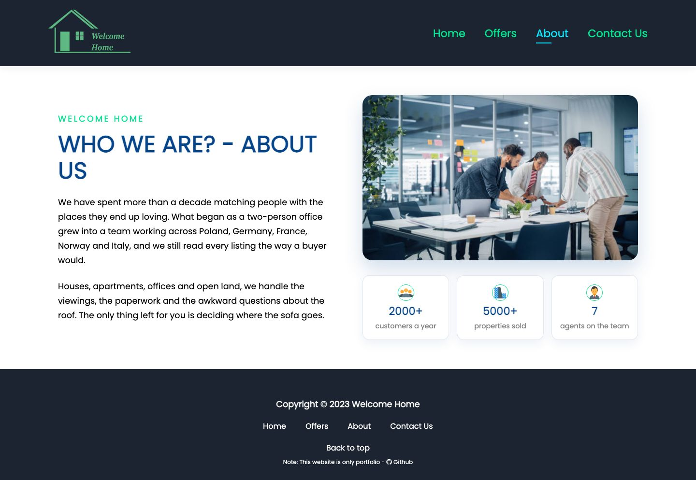
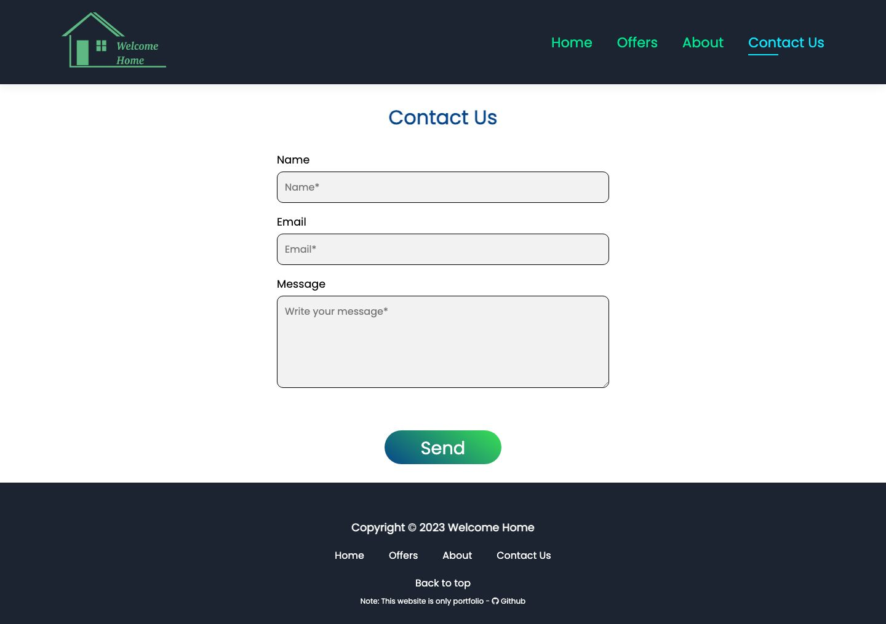
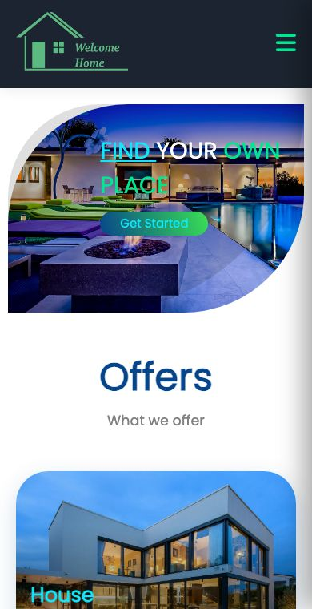
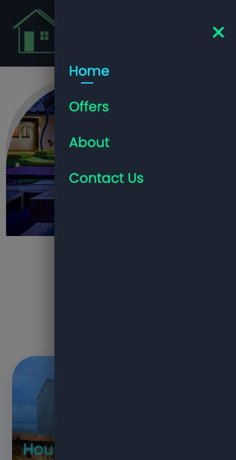

<h1 align="center">Welcome Home</h1>

<p align="center">
  A real estate front-end for browsing homes, offices and land to buy or rent 🏡
  <br />
  <a href="https://welcomehomesite.netlify.app/"><strong>Live site →</strong></a>
</p>



## About

A portfolio project: a single-page React app for a fictional estate agency
working across Poland, Germany, France, Norway and Italy. There is no backend —
the 20 listings live in a local data file — so it runs straight from
`npm start`.

## Features

- Browse 20 listings with photos, size, rooms, and purchase and rental prices
- Filter by country, property type and price range, in any combination
- Listing pages with full details and a contact form for the assigned agent
- Client-side validation on the contact and enquiry forms
- Star rating widget
- Responsive from 320px up, with a slide-in drawer menu on small screens

## Tech

- React 18 with React Router 6
- Context API for the search and filter state
- Headless UI for the dropdowns, react-icons for icons
- Plain CSS, one stylesheet per component

## Running locally

```bash
npm install
npm start
```

The app opens at `http://localhost:3000`. To make a production build:

```bash
npm run build
```

## Screenshots

### Offers



### About



### Contact



### Mobile

<p>
  
  
</p>

## Author

👤 **Rafał**

- Github: [@bezoski](https://github.com/bezoski)
